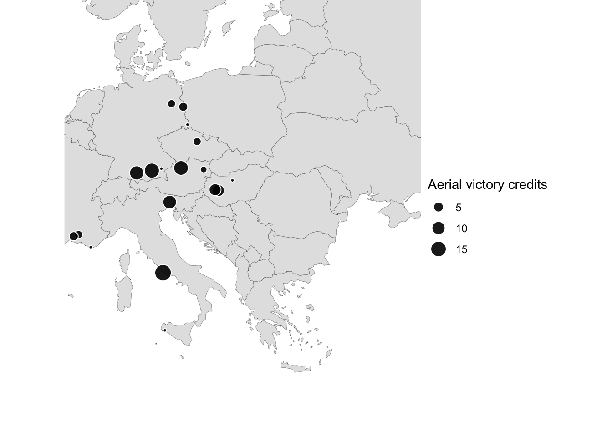

Tuskegee Airmen: Locations of Aerial Victories
================

## Dataset

The approximate locations of the aerial victories of the Tuskegee Airmen
during World War 2 have been extracted from documents on
[tuskegeeairmen.org](https://tuskegeeairmen.org) and provided as a [tsv
file](tuskegee_airmen_victory_locations.tsv).

### Variables

| Variable         | Description                                                              |
|------------------|--------------------------------------------------------------------------|
| date             | Date of the aerial victory                                               |
| text\_location   | location extracted from the text (e.g. “Munich area, Germany”)           |
| approx\_location | approximate location extracted from the text (e.g. “Munich, Germany”)    |
| lat\_lon         | Latitude and longitude provided by Google Maps API (format: “0.00,0.00”) |
| source           | Source document (see section “Sources” below)                            |

### Known issues

The location the aerial victories on 26 April 1945 is unclear/imprecise.

## How to use the data

``` r
library(tidyverse)
```

``` r
base_path <- here::here("2022", "06")
tuesdata <- tidytuesdayR::tt_load("2022-02-08")
```

    ## --- Compiling #TidyTuesday Information for 2022-02-08 ----

    ## --- There is 1 file available ---

    ## --- Starting Download ---

    ## 
    ##  Downloading file 1 of 1: `airmen.csv`

    ## --- Download complete ---

Separate Aerial victory credits column and extract dates:

``` r
aerial_victories <- tuesdata$airmen %>% 
  select(aerial_victory_credits) %>% 
  separate_rows(aerial_victory_credits, sep = "; ") %>% 
  na.omit() %>% 
  separate(aerial_victory_credits, #
           into = c("aerial_victory_credits", "aerial_victory_date"),
           sep = " on ", remove = TRUE) %>%
  mutate(aerial_victory_credits = str_extract(aerial_victory_credits, "\\d+ (1/2)?") %>% 
           str_replace(" 1/2", ".5") %>% 
           as.numeric(),
         aerial_victory_date = lubridate::mdy(aerial_victory_date)
         ) %>% 
  arrange(aerial_victory_date)
```

Load tsv file with location data and join with aerial victories dataset:

``` r
locations <- read_tsv(here::here(base_path, "data", "tuskegee_airmen_victory_locations.tsv")) %>% 
  separate(lat_lon, into = c("lat", "lon"), sep = ",") %>% 
  mutate(across(c(lat, lon), as.numeric))
```

    ## Rows: 26 Columns: 5
    ## ── Column specification ────────────────────────────────────────────────────────
    ## Delimiter: "\t"
    ## chr  (3): text_location, approx_location, lat_lon
    ## dbl  (1): source
    ## date (1): date
    ## 
    ## ℹ Use `spec()` to retrieve the full column specification for this data.
    ## ℹ Specify the column types or set `show_col_types = FALSE` to quiet this message.

``` r
knitr::kable(head(locations))
```

| date       | text\_location       | approx\_location     |      lat |      lon | source |
|:-----------|:---------------------|:---------------------|---------:|---------:|-------:|
| 1943-07-02 | Castelvetrano, Italy | Castelvetrano, Italy | 37.67851 | 12.79178 |      1 |
| 1944-01-27 | Anzio, Italy         | Anzio, Italy         | 41.44960 | 12.61973 |      1 |
| 1944-01-28 | Anzio, Italy         | Anzio, Italy         | 41.44960 | 12.61973 |      1 |
| 1944-02-05 | Anzio, Italy         | Anzio, Italy         | 41.44960 | 12.61973 |      1 |
| 1944-02-07 | Anzio, Italy         | Anzio, Italy         | 41.44960 | 12.61973 |      1 |
| 1944-06-09 | Udine area, Italy    | Udine, Italy         | 46.07107 | 13.23458 |      1 |

``` r
aerial_victories_locations <- aerial_victories %>% 
  inner_join(locations, by = c("aerial_victory_date" = "date")) %>% 
  group_by(approx_location, lat, lon) %>% 
  summarize(aerial_victory_credits = sum(aerial_victory_credits), .groups = "drop")
```

## Aerial victory locations on a map

``` r
europe <- rnaturalearth::ne_countries(scale = 50, continent = "Europe", 
                                      returnclass = "sf")

ggplot() +
  geom_sf(data = europe, fill = "grey89", size = 0.1) +
  geom_point(data = na.omit(aerial_victories_locations),
             aes(x = lon, y = lat, size = aerial_victory_credits),
             shape = 21, col = "white", fill = alpha("black", 0.9)) +
  coord_sf(xlim = c(5, 35), ylim = c(32, 58)) +
  labs(size = "Aerial victory credits") +
  theme_void()
```



### Sources

<sup>1</sup>
<https://tuskegeeairmen.org/wp-content/uploads/2020/11/TAI_Resources_112-Victories.pdf><br>
<sup>2</sup>
<https://tuskegeeairmen.org/wp-content/uploads/2020/11/TAI_Resources_TUSKEGEE-AIRMEN-CHRONOLOGY.pdf>
